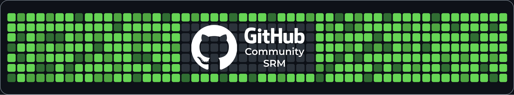
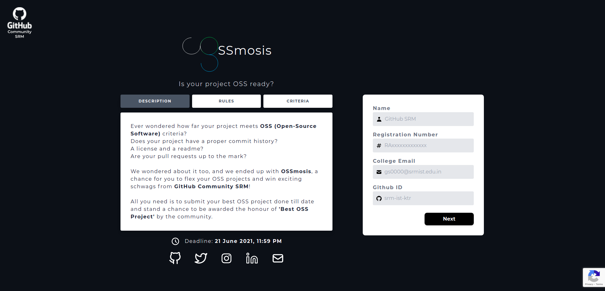

<div align="center">
  
</div>
<div align="center">
  
</div>

<br>
<p align="center">
<b> GitHub Community SRM is the foremost student-led community spearheading the Open Source Revolution at SRMIST, Chennai.</b>
</p>
<blockquote align="center"> 
  rendered with <span style="color: #8b0000;">&hearts;</span> by your friends at <a href="https://githubsrm.tech">GitHub Community SRM</a>.

</blockquote> 
<p align="center">
  <!-- replace 'githubsrm' with your repository name -->
 
 
 
    
    
    
</p>

## 💡 Project Description

The official portal for the project submissions of OSSmosis

## 📺 Preview

<div align="center">
  
</div>

## 📌 Prerequisites

### 💻 System requirement :

1. Any system with basic configuration.
2. Operating System : Any (Windows / Linux / Mac).

### 💿 Software requirement :

1. Updated browser
2. Node.js installed (If not download it [here](https://nodejs.org/en/download/)).
3. Python installed (If not download it [here](https://www.python.org/downloads/)).
4. Any text editor of your choice.

## Installation 🔧

Step One: Installation for Vue

```
$ cd web && yarn install
```

Step Two: Starting Vue server

```
$ yarn serve
```

Step Three: Installation for Python

```
$ cd server && pip install -r requirements.txt
```

Step Four: Starting Python server

```
$ python manage.py runserver
```


## 📜 License

**`OSSmosis Idea Form`** is available under the MIT license. See the LICENSE file for more info.

## 🤝 Contributing

Please read [`Contributing.md`](https://github.com/SRM-IST-KTR/oss-idea-form/blob/main/Contributing.md) for details on our code of conduct, and the process for submitting pull requests to us.

## ⚙️ Maintainers

| <p align="center"><br>[Riju Mukherjee](https://github.com/riju561)</p> | <p align="center"><br>[Aradhya Tripathi](https://github.com/Aradhya-Tripathi)</p> |
| -------------------------------------------------------------------------------------------------------------------------------------- | ------------------------------------------------------------------------------------------------------------------------------------------------ |

## 💥 Contributors

  <!-- replace 'githubsrm' with your repository name -->
<a href="https://github.com/SRM-IST-KTR/oss-idea-form/graphs/contributors">

</a>
                                                                                  
## 🚨 Forking this repo

Many people have contacted us asking if they can use this code for their own websites. The answer to that question is usually "yes", with attribution. There are some cases, such as using this code for a business or something that is greater than a personal project, that we may be less comfortable saying yes to. If in doubt, please don't hesitate to ask us.

We value keeping this site open source, but as you all know, _**plagiarism is bad**_. We spent a non-negligible amount of effort developing, designing, and trying to perfect this iteration of our website, and we are proud of it! All we ask is to not claim this effort as your own.

So, feel free to fork this repo. If you do, please just give us proper credit by linking back to our website, https://githubsrm.tech. Refer to this handy [quora post](https://www.quora.com/Is-it-bad-to-copy-other-peoples-code) if you're not sure what to do. Thanks!
